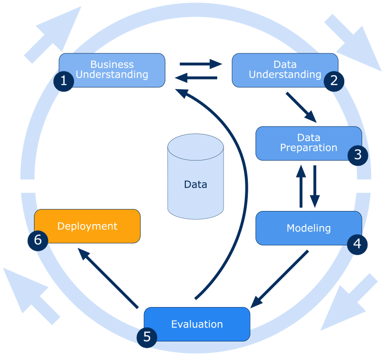

# Vendas da Loja Rossmann

Este projeto foi proposto no [kaggle](https://www.kaggle.com/c/rossmann-store-sales), para previsão de vendas usando dados da loja, promoção e concorrentes.

## Contexto

Rossmann opera mais de 3.000 drogarias em 7 países europeus. Atualmente, os gerentes de loja da Rossmann têm a tarefa de prever suas vendas diárias com até seis semanas de antecedência. As vendas da loja são influenciadas por muitos fatores, incluindo promoções, competição, feriados escolares e estaduais, sazonalidade e localidade. Com milhares de gerentes individuais prevendo vendas com base em suas circunstâncias únicas, a precisão dos resultados pode ser bastante variada.

## Desafio

### Problema
- Definição de orçamento apara reforma das Lojas.

### Causas
- Predição de vendas atual apresenta muita divergencia.
- O processo de predição de vendas é baseado em experiencias passadas.
- Toda previsão de Vendas é feita Manualmente pelas 1.115 Lojas Rossmann.
- A visualisação das vendasndas é limitada ao computador.

## Solucão
- Usar um método cientifico (Machine Learning).
- Realizar a Previsão de vendas de todas as lojas de forma automatica.
- Visialização das prediçoes de venda pelo smartphone.

## Metodologia CRISP-DM

